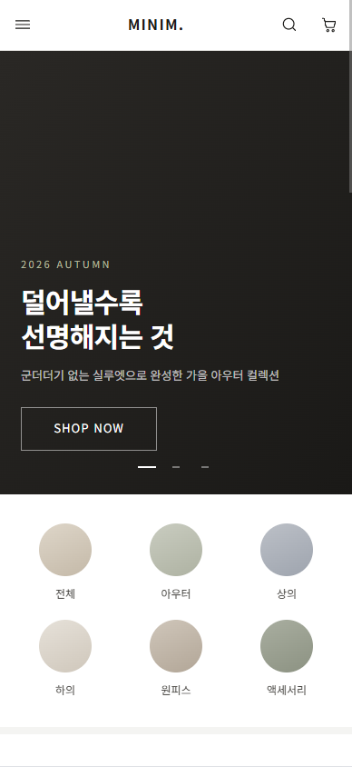
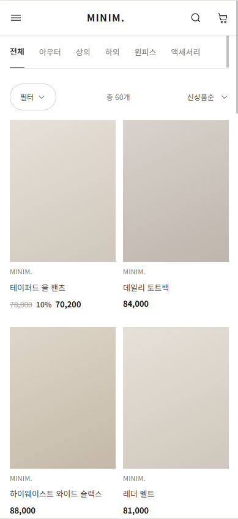
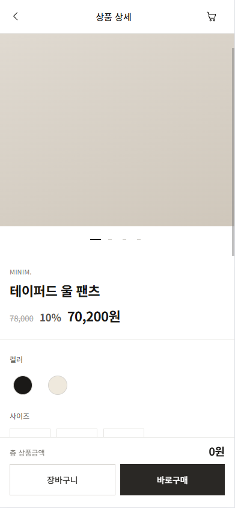
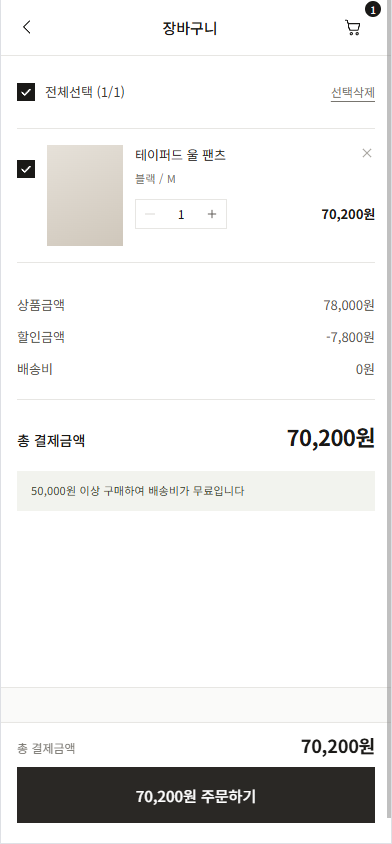

# MINIM.

> 미니멀 모던 컨셉의 반응형 패션 커머스 프론트엔드

**[🔗 데모 보기 → wnsud5959.github.io/minim-shop](https://wnsud5959.github.io/minim-shop/)**


| 메인 | 상품 리스트 |
|:---:|:---:|
|  |  |
| **상품 상세** | **장바구니** |
|  |  |

---

## 개요

| 항목 | 내용 |
|------|------|
| 기간 | 2026.08 (약 1주) |
| 인원 | 1인 — AI 에이전트를 기획·디자인·개발·QA 팀 단위로 운용 |
| 범위 | 메인 / 상품 리스트 / 상품 상세 / 장바구니 / 주문서 / 로그인 / 회원가입 / 404 |
| 대응 | 375px · 768px · 1440px 반응형 |
| 규모 | TypeScript 32개 파일, 약 4,300 LOC · 의존성 4개 |
| 품질 | 유닛 테스트 54개 · 검수 항목 88건 · 누적 결함 69건 |
| 배포 | GitHub Actions → GitHub Pages 자동 배포 (typecheck → test → build) |

**AI 활용을 어디까지 통제할 수 있는가**를 검증하려고 진행한 프로젝트입니다. 코드 생산보다 **요구사항 정의 → 정책 확정 → 결함 관리 → 회귀 검증**의 파이프라인을 세우는 데 무게를 뒀고, 그 과정이 전부 문서로 남아 있습니다.

통제가 실제로 작동했는지는 결과로 판단했습니다. 2차 QA 라운드에서 **1차 수정이 만든 회귀 BLOCKER 2건**을 잡아냈고, 그중 하나는 개발 서버에서는 드러나지 않고 빌드에서만 터지는 타입 에러였습니다. 이 사건에서 나온 규칙을 CI의 typecheck 게이트로 자동화했습니다.

---

## 기술 스택

| 영역 | 선택 | 이유 |
|------|------|------|
| 빌드 | Vite 5 | 개발 서버 속도, 설정 최소화 |
| 프레임워크 | React 18 + TypeScript 5.6 | `strict: true`, 빌드 시 타입 게이트 |
| 스타일 | Tailwind CSS 3.4 | 디자인 토큰을 설정 파일 하나로 강제 |
| 라우팅 | react-router-dom 6 | 쿼리스트링 기반 상태 동기화 |
| 상태 | Zustand 4.5 | 보일러플레이트 없이 `persist` 미들웨어 사용 |
| 데이터 | Mock API 레이어 | 실 API 전환 시 `src/api/` 만 교체 |

**의존성 4개** (react, react-dom, react-router-dom, zustand). 캐러셀·모달·폼 라이브러리를 쓰지 않고 직접 구현해 번들과 제어권을 확보했습니다.

---

## 구현 하이라이트

### 1. 디자인 토큰 단일 소스화

`디자인토큰.json` → `tailwind.config.js` 로 반영하고, 컴포넌트에서 **색상 하드코딩을 0으로** 유지했습니다.

```js
colors: {
  ink:   { 0:'#FFFFFF', 100:'#F4F4F2', 500:'#78756F', 800:'#2A2825', 900:'#1A1917' },
  olive: { 50:'#F2F3EE', 500:'#6E7455', 700:'#464B36' },
}
fontSize: {
  h1: ['1.375rem', { lineHeight:'1.3', letterSpacing:'-0.02em', fontWeight:'700' }],
  price: ['1.125rem', { lineHeight:'1.2', letterSpacing:'-0.01em', fontWeight:'700' }],
}
```

- 타이포는 크기·행간·자간·굵기를 한 토큰에 묶어 조합 실수를 차단
- 본문 조합 전부 **WCAG AA 대비비 검증** (sRGB 선형화로 계산, 4.5:1 이상)
- `borderRadius` 기본값을 `0px` 로 두어 브랜드 톤을 시스템 레벨에서 고정

### 2. 필터·정렬 상태를 URL로

리스트 화면의 카테고리·가격대·사이즈·정렬·페이지를 전부 쿼리스트링에 동기화했습니다.

```
/products?cat=outer&size=M&sort=price_asc&page=2
```

- 새로고침·뒤로가기·링크 공유에서 화면이 그대로 복원됨
- 모든 파라미터를 **허용값 화이트리스트로 검증** — 조작된 쿼리로 화면이 깨지지 않음
- `page` 변경만 있을 때는 `replace: true` 로 히스토리 오염 방지

### 3. 영속 상태 스키마 마이그레이션

장바구니는 `localStorage` 에 남습니다. 그래서 **상품 옵션명을 바꾸는 순간 기존 사용자의 데이터가 깨집니다.**

```ts
persist(..., {
  name: 'minim-cart',
  version: 1,
  migrate: (persisted, version) => {
    // v0 → v1 : 컬러 'ivory' → 'white' 로 통합. cartId까지 재생성.
    if (version === 0) { /* ... */ }
  },
})
```

QA 2차에서 실제로 발견된 결함이고, 마이그레이션 없이 배포했다면 재방문 사용자의 장바구니가 빈 화면이 됐을 케이스입니다.

### 4. 저장소 예외 격리

시크릿 모드·용량 초과 환경에서는 `localStorage` 접근 자체가 예외를 던집니다. 초기 구현은 이 예외가 **장바구니 담기 전체를 실패시켰습니다.**

```ts
export function createSafeStorage(pick?: (value: string) => Storage) {
  return {
    getItem: (name: string): string | null => { try { ... } catch { return null } },
    setItem: (name: string, value: string): void => { try { ... } catch { /* 무시 */ } },
    removeItem: (name: string): void => { try { ... } catch { /* 무시 */ } },
  };
}
```

- 저장 실패해도 **메모리 상태는 정상 동작** — 기능이 죽지 않음
- 로그인 유지 체크 여부에 따라 `localStorage` / `sessionStorage` 로 라우팅하고 반대편은 정리

### 5. 라이브러리 없는 모바일 스와이프 갤러리

상품 상세의 이미지 전환을 CSS `scroll-snap` 으로 구현했습니다.

- `scroll-snap-type: x mandatory` + `overscroll-x-contain`
- 스크롤 위치 → 인디케이터 동기화는 **rAF 스로틀링** 으로 처리
- 인디케이터 클릭 시 `scrollTo` 역방향 제어
- 캐러셀 라이브러리 대비 **번들 증가 0**, 네이티브 관성 스크롤 유지

### 6. 실패 경로 설계

- API 호출 7개 지점 전부 `.catch` + 재시도 UI (`ErrorState`)
- 최상위 `ErrorBoundary` — 손상된 저장 데이터로 인한 렌더 예외 시 **저장소 초기화 후 복구** 경로 제공
- 장바구니 마운트 시 카탈로그와 재고 재검증 → 품절 항목 자동 처리
- 주문 완료 화면은 제출 시점 스냅샷을 사용 (스토어 초기화와 무관하게 정확한 내역 표시)

---

## 아키텍처

```
src/
├─ api/          Mock API — 실 API 전환 시 이 폴더만 교체
├─ components/
│  ├─ layout/    Header, Drawer, Footer, Layout
│  └─ ui/        Button, Field, Controls, ProductCard, Feedback, ErrorBoundary
├─ lib/          constants(정책값), format(금액·검증), storage(예외 격리)
├─ mock/         결정론적 목업 60건 (5 카테고리 × 12)
├─ pages/        8개 라우트
├─ store/        cartStore, authStore, uiStore
└─ types.ts
```

**Mock 데이터는 결정론적으로 생성**합니다. 인덱스를 시드로 한 의사난수를 써서 새로고침해도 가격·재고·색상이 동일하고, 그 덕에 QA 재현 절차가 성립합니다.

**정책값은 `lib/constants.ts` 로 격리**했습니다.

```ts
FREE_SHIPPING_THRESHOLD = 50000   // 5만원 이상 무료배송
SHIPPING_FEE            = 3000
MAX_QTY                 = 10
```

---

## 개발 프로세스

기획 → 디자인 → 개발 → QA 단계를 밟고 각 단계 산출물을 남겼습니다.

| 단계 | 산출물 |
|------|--------|
| 기획 | 요구사항정의서, IA·사이트맵, 화면정책서, Mock 데이터 스키마, 와이어프레임 |
| 디자인 | 디자인시스템, 디자인토큰(JSON), 컴포넌트 명세, 하이파이 시안 |
| 개발 | 아키텍처 문서, QA 체크리스트 88항목 |
| QA | 테스트계획서, 결함관리 프로세스, 결함리포트 3건 |
| 공통 | 회의록 8건, WBS, 협업 규약, 용어사전, 의사결정 기록, 브랜치 전략 |

### QA — 누적 결함 69건

가장 값어치 있었던 건 **2차 회귀 라운드**입니다. 1차에서 고친 24건 중 **2건이 새로운 BLOCKER를 만들었습니다.**

| ID | 내용 | 왜 놓쳤나 |
|----|------|-----------|
| QA-029 | 타입 어노테이션 제거로 `tsc -b` 실패 → 빌드 붕괴 | dev 서버는 타입 검사를 하지 않아 화면상 정상으로 보임 |
| QA-030 | 페이지네이션을 URL로 옮기자 `search` 변경 감지와 충돌 → 더보기 클릭 시 최상단 점프 | 두 기능이 각각은 정상, 조합에서만 실패 |

여기서 나온 규칙을 프로세스로 승격시켰습니다.

- **P-01** 개발 완료 시점에 화면정책서와 스펙 diff 수행
- **P-02** 수정 10건 초과 시 별도 회귀 라운드 편성
- **P-03** 영속 스키마 변경 시 마이그레이션 계획 필수
- **P-04** dev 서버 확인으로 검증 종료 금지 — `npm run build` 필수
- **P-06** 결함 종료 시 체크리스트 항목으로 승격 — 발견한 결함을 재발 방지 그물로 전환
- **P-08** 문서와 코드가 다르면 먼저 **정본을 판정**하고, 정본이 아닌 쪽을 고친다

P-04는 이후 **CI의 typecheck·test 게이트**로 자동화했고, P-06으로 체크리스트가 43 → 88항목이 됐습니다.

P-08은 3차 감사에서 나왔습니다. 문서-코드 불일치 13건 중 **2건은 문서가 옳고 코드가 틀렸습니다.** 문서를 코드에 맞추는 관행이었다면 결함 2건을 스스로 지울 뻔했습니다.

### 테스트

| 대상 | 왜 여기부터인가 |
|------|-----------------|
| 금액 계산 · 배송비 경계 | 사용자가 신고하기 전엔 틀린 걸 아무도 모르는 도메인. 0원 / 49,999 / 50,000 경계와 **정가 아닌 판매가 기준** 판정을 고정 |
| 재고 상한 · 옵션 병합 | 정책 상한(10개)과 물리 상한(재고)이 따로 있어 `min()` 이 필요. 없는 걸 파는 사고를 막음 |
| 주문 대상 결정 | 바로구매와 장바구니 우선순위. "화면은 뜨는데 대상이 틀림" 유형이라 눈으로 못 잡음 |
| 목업 데이터 무결성 | 품절 상품이 0건이면 품절 UI 검증이 불가능해짐 (QA-061) |

```bash
npm run test     # 54개
```

유닛 테스트는 순수 함수에 집중했습니다. **타입 검사는 "숫자를 넣었는가"를 묻고, 테스트는 "맞는 숫자가 나왔는가"를 묻습니다.** `>=` 를 `>` 로 바꿔도 타입은 통과하지만 정확히 5만원어치를 산 고객만 배송비를 내게 됩니다.

### 브랜치 전략 · CI/CD

GitHub Flow — `main` + 작업 브랜치 + PR + **Squash merge**.

```
증상 발견 → git blame → 커밋의 (#PR번호) → PR 본문의 결함ID
         → 결함리포트 재현절차 → PR의 CI 로그
```

- PR 1개 = main 커밋 1개 = `git revert` 단위 1개
- 브랜치명에 결함ID 포함 (`fix/QA-031-cart-stock-sync`)
- `main` 보호: PR 필수 + CI(`verify`) 통과 필수 + force push 차단
- PR 템플릿에 **사이드이펙트 점검 항목** 포함 — QA-030 유형 재발 방지

| 워크플로 | 트리거 | 동작 |
|----------|--------|------|
| `ci.yml` | PR → main | `npm ci` → `typecheck` → **`test`** → `build` |
| `deploy.yml` | main push | 위 + `BASE_PATH` 주입 → Pages 배포 |

GitHub Pages는 history fallback이 없어 `404.html` 을 `index.html` 사본으로 배포합니다. 상세 페이지 직접 접근·새로고침이 동작하는 이유입니다.

---

## 실행

```bash
npm install
npm run dev        # http://localhost:5173
npm run test       # 유닛 테스트 54개
npm run build      # 타입체크 + 프로덕션 빌드
npm run typecheck  # 타입만 검사
```

### 테스트 계정

- 이메일 아무 값 / 비밀번호 `minim1234`
- 중복 이메일 시나리오: `test@test.com`

---

## 알려진 제약

정직하게 적습니다.

- **백엔드 없음** — 인증·주문이 Mock. 실 서비스 수준의 세션 관리 아님
- **E2E 테스트 없음** — 유닛 테스트는 54개 있으나 사용자 플로우 전 구간 검증은 미도입
- **실기기 검증 미완** — 검수 항목 88건 중 브라우저 실측은 일부. 나머지는 코드 검증
- **접근성 미완** — 모달 포커스 트랩, 오류 메시지 `aria-describedby` 연결 미구현 (QA-058·066)
- **상품 이미지 미확보** — 그라디언트 플레이스홀더 사용 (비율 3:4 고정, `` 교체만 하면 됨)
- 1차 제외: 실 결제(PG), 관리자, 리뷰, 마이페이지, 소셜 로그인 실연동, 통합 검색, 주소 검색 API

## 다음 단계

1. **실기기 검증 라운드** — 88항목을 375 / 768 / 1440에서 순회
2. **접근성 보완** — 모달 3종 포커스 관리 공통 훅, 폼 오류 메시지 연결
3. **Playwright E2E** — 상품 → 옵션 → 장바구니 → 주문서 전 구간
4. **Supabase 연동** — Auth(실 JWT 세션), Postgres 스키마, RLS 기반 주문 조회 권한
5. **재고 차감 트랜잭션** — 동시 주문 시 음수 재고 방지 (행 잠금)
